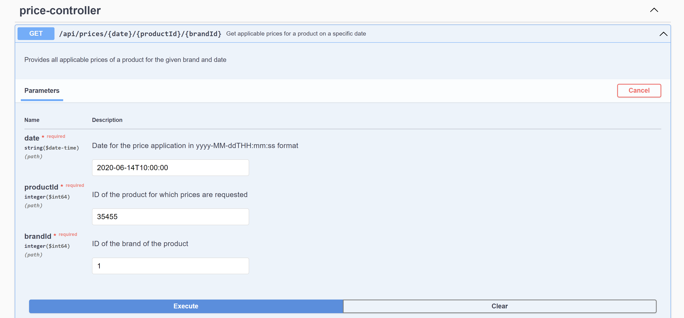
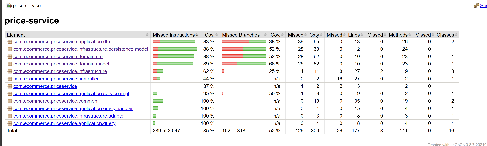

# Price-Service

El servicio de Price-Service está diseñado para gestionar y aplicar precios a productos en plataformas de comercio electrónico. Se basa en una serie de reglas complejas para determinar el precio final de un producto, considerando factores como la prioridad de las tarifas y los períodos de validez.

## Arquitectura y Patrones de Diseño

La construcción de este servicio utiliza una **arquitectura hexagonal** y sigue los principios de **Domain-Driven Design (DDD)**. Esto garantiza una clara separación entre la lógica de negocio (el dominio) y las interacciones externas (adaptadores e infraestructura).

Se emplea el patrón **Command Query Responsibility Segregation (CQRS)** para separar las operaciones de lectura y escritura, mejorando la escalabilidad y auditabilidad del sistema.

El desarrollo se ha llevado a cabo mediante **Test-Driven Development (TDD)**, asegurando que cada componente cumple con los requisitos funcionales antes de avanzar en el desarrollo.

## Arquitectura Hexagonal

### Capa de Aplicación (Application Layer)

#### PriceController (Adaptador Primario)
- **Descripción**: Recibe las solicitudes del cliente externo y las comunica al sistema.
- **Relación**: Invoca servicios a través de `IPriceService`.

#### IPriceService (Puerto Primario)
- **Descripción**: Define las operaciones de alto nivel que el adaptador primario puede invocar.
- **Relación**: Implementado por `PriceServiceImpl`.

#### PriceServiceImpl (Componente)
- **Descripción**: Procesa las solicitudes relacionadas con precios.
- **Relación**: Utiliza `MediatorService` y retorna `GeneralResponseDTO`.

#### MediatorService (Mediador)
- **Descripción**: Coordina la comunicación entre diferentes componentes.
- **Relación**: Delega operaciones a `GetPriceQueryHandler`.

#### GetPriceQueryHandler (Handler)
- **Descripción**: Maneja la lógica de consulta de precios.
- **Relación**: Interactúa con el dominio mediante `PricePort`.

### Capa de Dominio (Domain Layer)

#### PriceEntity (Entidad de Dominio)
- **Descripción**: Encapsula la lógica y reglas de negocio para precios.
- **Relación**: Se asocia con `PriceDomainDTO`.

#### PriceDomainDTO (DTO de Dominio)
- **Descripción**: Facilita la transferencia de datos del dominio.
- **Relación**: Se utiliza para la comunicación entre capas.

#### PricePort (Puerto Secundario)
- **Descripción**: Expone operaciones de dominio para otros componentes.
- **Relación**: Implementado por `JpaPricePortAdapter`.

### Capa de Infraestructura (Infrastructure Layer)

#### PriceRepository (Repositorio de Precios)
- **Descripción**: Maneja la persistencia de datos de precios.
- **Relación**: Accedido por `JpaPricePortAdapter`.

#### JpaPricePortAdapter (Adaptador Secundario)
- **Descripción**: Conecta el dominio con la infraestructura de persistencia.
- **Relación**: Adapta llamadas a `PriceRepository`.

### Preocupaciones Cruzadas (Cross-cutting Concerns)

#### GeneralResponseDTO (DTO de Respuesta General)
- **Descripción**: Normaliza las respuestas enviadas a los clientes.
- **Relación**: Construido y retornado por `PriceServiceImpl`.

### Interacciones Generales

El **Cliente Externo** interactúa con el sistema a través del **PriceController**. **PriceServiceImpl** coordina las solicitudes con **MediatorService** y **GetPriceQueryHandler**. La **Capa de Dominio** encapsula la lógica de negocio. **JpaPricePortAdapter** vincula el dominio con la persistencia de datos. La arquitectura hexagonal asegura independencia y escalabilidad.


## Configuración y Requisitos Técnicos

El servicio de Price-Service ha sido desarrollado utilizando las siguientes tecnologías y herramientas:

- **JDK**: Versión 17
- **Spring Boot**: Versión 2.7.12
- **Spring Framework**: Con los módulos Spring Boot Starter, Spring Boot Starter Actuator, Spring Boot Starter Web, y Spring Boot Starter Data JPA para la construcción del servicio REST y la interacción con la base de datos.
- **ModelMapper**: Para mapear entre los objetos de dominio y los DTOs.
- **SpringDoc OpenAPI**: Para generar la documentación de la API REST de forma automatizada.
- **H2 Database**: Como base de datos en memoria para pruebas y desarrollo.
- **Lombok**: Para minimizar el código repetitivo de Java, especialmente getters, setters, y métodos de construcción.
- **Jacoco**: Para la generación de informes de cobertura de pruebas.

### Requisitos del Sistema para Levantar la Aplicación:

- JDK 17 instalado y configurado correctamente en la máquina.
- Gradle para la gestión de dependencias y construcción del proyecto.
- Memoria y CPU adecuadas para ejecutar una aplicación Spring Boot; esto dependerá del tamaño y la carga de la aplicación, pero una regla general podría ser al menos 2 GB de RAM libre y un procesador moderno.


## Contexto

En la base de datos de comercio electrónico de la compañía, contamos con la tabla `PRICES` que refleja el precio final y la tarifa que aplica a un producto de una cadena entre ciertas fechas. A continuación, se muestra un ejemplo de la tabla con los campos relevantes:

## PRICES

| BRAND_ID | START_DATE           | END_DATE             | PRICE_LIST | PRODUCT_ID | PRIORITY | PRICE | CURR |
|----------|----------------------|----------------------|------------|------------|----------|-------|------|
| 1        | 2020-06-14-00.00.00  | 2020-12-31-23.59.59  | 1          | 35455      | 0        | 35.50 | EUR  |
| 1        | 2020-06-14-15.00.00  | 2020-06-14-18.30.00  | 2          | 35455      | 1        | 25.45 | EUR  |
| 1        | 2020-06-15-00.00.00  | 2020-06-15-11.00.00  | 3          | 35455      | 1        | 30.50 | EUR  |
| 1        | 2020-06-15-16.00.00  | 2020-12-31-23.59.59  | 4          | 35455      | 1        | 38.95 | EUR  |


### Campos:

- **BRAND_ID**: Clave foránea de la marca (1 = XYZ).
- **START_DATE, END_DATE**: Rango de fechas durante las cuales se aplica el precio de la tarifa indicada.
- **PRICE_LIST**: Identificador de la lista de precios aplicable.
- **PRODUCT_ID**: Código identificador del producto.
- **PRIORITY**: Desambiguador para la aplicación del precio. Si dos tarifas coinciden dentro de un rango de fechas, se aplica aquella con la mayor prioridad (valor numérico).
- **PRICE**: Precio final de venta.
- **CURR**: Moneda en formato ISO.

### Lo que se solicita:

Construir una aplicación/servicio en SpringBoot que proporcione un endpoint REST de tal manera que:

- Acepte como parámetros de entrada: Fecha de aplicación, Identificador de producto, Identificador de marca.
- Devuelva como datos de salida: identificador de producto, identificador de marca, tarifa aplicable, fechas de aplicación y precio final a aplicar.
- Se debe usar una base de datos en memoria (por ejemplo, H2) e inicializarla con los datos del ejemplo (puede cambiar los nombres de los campos y agregar nuevos si lo desea; elija el tipo de datos que considere apropiado para ellos).

### Desarrollar algunas pruebas para el endpoint REST que validen las siguientes solicitudes de servicio con los datos de ejemplo:

- Prueba 1: Solicitud a las 10:00 a.m. del día 14 para el producto 35455 de la marca 1 (XYZ).
- Prueba 2: Solicitud a las 16:00 p.m. del día 14 para el producto 35455 de la marca 1 (XYZ).
- Prueba 3: Solicitud a las 21:00 p.m. del día 14 para el producto 35455 de la marca 1 (XYZ).
- Prueba 4: Solicitud a las 10:00 a.m. del día 15 para el producto 35455 de la marca 1 (XYZ).
- Prueba 5: Solicitud a las 21:00 p.m. del día 16 para el producto 35455 de la marca 1 (XYZ).

### Casos de prueba 
Estos son los casos de prueba realizados desde la siguiente ruta del Swagger: http://localhost:8086/zara/services/ecomerce/v1/swagger-ui/index.html#/price-controller/getPrices

#### Test 1: Consulta de Precios

- **Fecha y Hora de Consulta**: 10:00, 14 de junio
- **Producto**: 35455
- **Marca**: 1 (XYZ)
- **URL de Consulta**:
  [http://localhost:8086/zara/services/ecommerce/v1/api/prices/2020-06-14T10:00:00/35455/1](http://localhost:8086/zara/services/ecommerce/v1/api/prices/2020-06-14T10:00:00/35455/1)

#### Resultado Esperado
- **Precio**: 35.50 EUR
- **Razón**: En el momento de la consulta, el único precio aplicable es el que tiene un intervalo desde `2020-06-14-00.00.00` hasta `2020-12-31-23.59.59`, con una prioridad de 0.


#### Evidencia



#### Test 2: Consulta de Precios

- **Fecha y Hora de Consulta**: 16:00, 14 de junio
- **Producto**: 35455
- **Marca**: 1 (XYZ)
- **URL de Consulta**:
  [http://localhost:8086/zara/services/ecommerce/v1/api/prices/2020-06-14T16:00:00/35455/1](http://localhost:8086/zara/services/ecommerce/v1/api/prices/2020-06-14T16:00:00/35455/1)

#### Resultado Esperado
- **Precio**: 25.45 EUR
- **Razón**: En este momento específico, el precio con mayor prioridad (1) es el que se aplica desde las 15:00 hasta las 18:30.

#### Evidencia


#### Test 3: Consulta de Precios

- **Fecha y Hora de Consulta**: 21:00, 14 de junio
- **Producto**: 35455
- **Marca**: 1 (XYZ)
- **URL de Consulta**:
  [http://localhost:8086/zara/services/ecommerce/v1/api/prices/2020-06-14T21:00:00/35455/1](http://localhost:8086/zara/services/ecommerce/v1/api/prices/2020-06-14T21:00:00/35455/1)

#### Resultado Esperado
- **Precio**: 35.50 EUR
- **Razón**: Después de las 18:30 del 14 de junio, el único precio aplicable es nuevamente el de prioridad 0.

#### Evidencia


#### Test 4: Consulta de Precios

- **Fecha y Hora de Consulta**: 10:00, 15 de junio
- **Producto**: 35455
- **Marca**: 1 (XYZ)
- **URL de Consulta**:
  [http://localhost:8086/zara/services/ecommerce/v1/api/prices/2020-06-15T10:00:00/35455/1](http://localhost:8086/zara/services/ecommerce/v1/api/prices/2020-06-15T10:00:00/35455/1)

#### Resultado Esperado
- **Precio**: 30.50 EUR
- **Razón**: Correspondiente al precio con prioridad 1 para esa fecha y hora.


#### Evidencia


### Test 5: Consulta de Precios

- **Fecha y Hora de Consulta**: 21:00, 16 de junio
- **Producto**: 35455
- **Marca**: 1 (XYZ)
- **URL de Consulta**:
  [http://localhost:8086/zara/services/ecommerce/v1/api/prices/2020-06-16T21:00:00/35455/1](http://localhost:8086/zara/services/ecommerce/v1/api/prices/2020-06-16T21:00:00/35455/1)

#### Resultado Esperado
- **Precio**: 38.95 EUR
- **Razón**: En esa fecha y hora, el precio aplicable es el que inicia su validez a las 16:00 del 15 de junio.

#### Evidencia


### Evidencia de las pruebas realziadas:





### Instrucciones para Clonar el Proyecto "Price Service" de GitHub

Para clonar el proyecto "Price Service" desde GitHub, sigue estos pasos:

1. **Instalar Git**: Asegúrate de tener instalado Git en tu sistema. Si no lo tienes, puedes descargarlo desde [Git - Downloads](https://git-scm.com/downloads).

2. **Abrir la Terminal**: Abre la terminal (Command Prompt, PowerShell, Terminal, etc.) en tu computadora.

3. **Navegar al Directorio Deseado**: Navega hasta el directorio donde deseas que el proyecto sea clonado.

4. **Ejecutar el Comando de Clonación**: Escribe el siguiente comando y presiona Enter:

    ```plainte
    git clone https://github.com/sistemas0011ff/Price-Service.git
    ```

5. Una vez completado, se creará un directorio llamado "Price-Service" en tu ubicación actual, conteniendo los archivos


#### Autor 
Correo: efajardogutierrez@hotmail.com